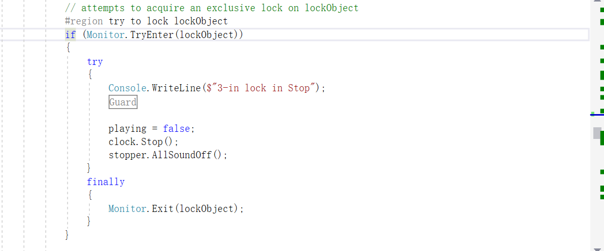
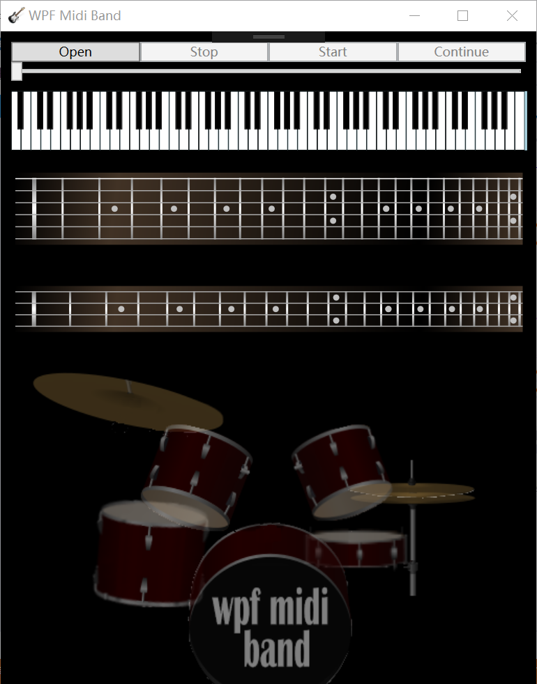

# lab03
C# lab3, by Lu Yuan, May 10th, 2019

## Introduction
1. This app is based on WPFMidiBand
2. This app is used to play midi files and presented it with different kinds of instruments
3. Equipped the original app with a flexible size of component which can change automatically wheneven the size of window changed

## Implement of dealing the deadlock bug when click stop button
1. This function is implemented in the region "try to lock lockObject" in Sequencer.cs
2. The main idea is to try to find out whether lockObject has been locked before lock it, which needed to call a system function Monitor.tryEnter(lockObject)
3. This function cannot solve this problem totally, for when you press the stop button, it will do nothing instead of being deadlock sometimes
4. screencut 

## Change log
#### first version(5b55731), released in 23:49, May 9th, 2019
1. fix the deadlock bug when click stop button
2. use viewbox to equip the comonent with a flexible size
3. screencut 
